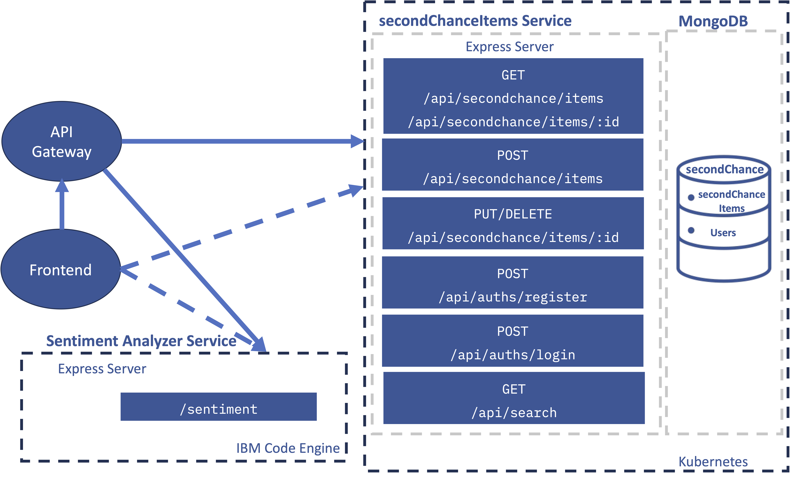

  

<h1 align="center">Second Chance Back-End Application</h>

  
  

# Overview

In the course's final week, the skills will be applied to complete a Second Chance Back-End Application, which has been done according to established architecture and requirements. This project marked the conclusion of IBM Back-end JavaScript Developer Professional Certificate, representing the pinnacle of the Back-end JavaScript Developer Development Track.

### Work Structure
1. Finish user stories: Develop a GitHub user story template and subsequent user stories for the application’s development.
2. Initialize and populate MongoDB: Set up the NoSQL MongoDB database that provides the data and data management for the application, including populating MongoDB.
3. Run skeleton application: Get started with various functions and obtain some of the code for the backend services by cloning the skeleton code from your GitHub account.
4. Implement SecondChanceItems service API
5. Implement Search service API
6. Implement Sentiment Analysis service API
7. Implement Registration backend service API
8. Implement Login backend service API
9. Implement User Profile backend service API
10. Integrate the frontend provided with the backend
11. Add CI/CD pipelines for backend services
12. Containerize the services and applications
13. Deploy backend services

## User Stories
User stories are a fundamental component in Agile methodologies, serving as a simple yet powerful tool for understanding user requirements. They are typically written from a user's perspective and focus on what they need from the system to achieve a specific goal. A well-crafted user story is concise and focuses on a single functionality or feature, helping to break down complex projects into manageable work units.

Create thirteen user stories in your GitHub repository, one for each of the above steps of your project.

## Assignment Breakdown
- First Assignment: 
  - Develop a GitHub user story template and subsequent user stories.
  - Set up the MongoDB database and populate it.
  - Get started with the skeleton application.

- Second Assignment: 
  - Implement various backend services including SecondChanceItems, Search, Sentiment Analysis, Registration, Login, and User Profile.
  - Integrate the frontend with the backend.

- Third Assignment: 
  - Add CI/CD pipelines for backend services.
  
- Fourth Assignment: 
  - Containerize the services and applications.
  - Deploy backend services.